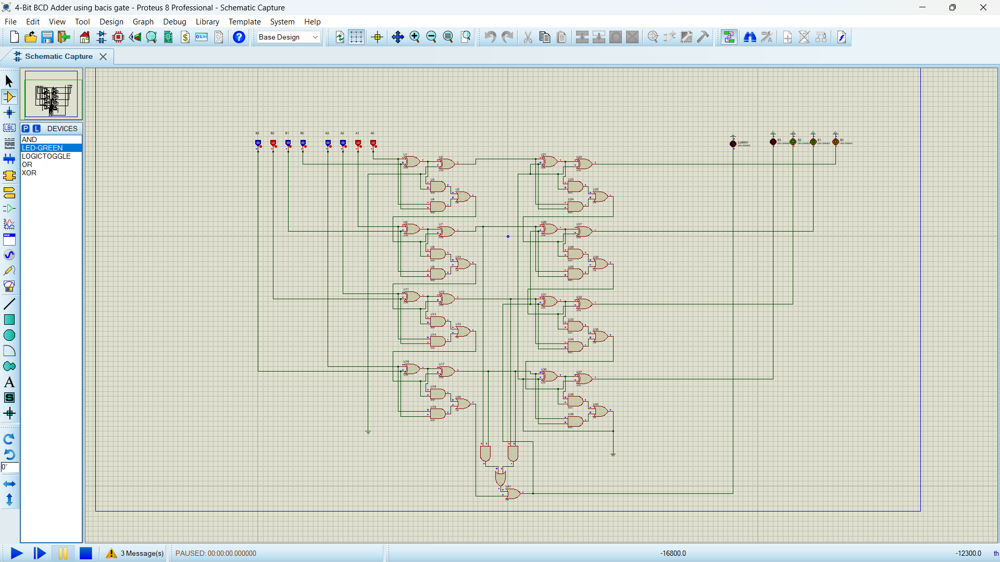

# 🔢 1-Digit BCD Adder (Logic Gate Implementation)

A simple **1-digit BCD (Binary-Coded Decimal) adder** implemented using only **basic logic gates** (`XOR`, `AND`, `OR`), `toggle switches`, and `green LEDs`. This project is designed to demonstrate how BCD addition and correction work at the gate level.

---

## 🚀 Features

- Adds two **1-digit BCD numbers** (0–9)
- Uses **basic gates only** (no ICs or microcontrollers)
- Implements **BCD correction** (adds 6 when needed)
- Displays output using **green LEDs**
- Inputs provided via **toggle switches**

---

## 🔧 Components Used

- XOR gates  
- AND gates  
- OR gates  
- Ground (GND)  
- Toggle switches (8 total for 2 BCD inputs)  
- Green LEDs (for 4-bit sum output and carry)

---

## ⚙️ How It Works

1. **Inputs**: Two BCD digits (A and B), each 4 bits wide (valid range: 0000 to 1001).
2. **Binary Addition**: Basic full adder logic adds the inputs.
3. **BCD Correction**: If the sum exceeds 9 (1001), the circuit adds `0110` (decimal 6) to correct it.
4. **Output**: Corrected 4-bit BCD sum shown on LEDs. If there's a carry, it's indicated by an additional LED.

> ⚠️ **Note:** Inputs must be valid BCD (0–9). Invalid inputs (like 1010–1111) may cause incorrect results.
> 
---

### 🧪 BCD Addition Test Cases

This section shows three test cases of 1-digit BCD addition simulated using Proteus.

---

#### ✅ Case 1: 3 + 4 = 7 (Valid BCD, No Correction Needed)
- Binary: `0011 + 0100 = 0111`
- BCD Result: `0111` (7)
- ✅ No correction needed as sum ≤ 9.

---

#### ✅ Case 2: 5 + 4 = 9 (Valid BCD Edge Case)
- Binary: `0101 + 0100 = 1001`
- BCD Result: `1001` (9)
- ✅ Still within valid BCD range, so no correction needed.

---

#### ⚠️ Case 3: 5 + 8 = 13 (Invalid BCD, Correction Applied)
- Binary sum: `0101 + 1000 = 1101` → decimal 13
- 13 is invalid in BCD, so we add `0110` (6) to correct it.
- Corrected sum: `1101 + 0110 = 1 0011` → BCD Output: `0001 0011` (13)
- ✅ Carry = 1 (1)2 , Sum = 3 (0011)2

---

## 📄 License

This project is for educational purposes. Feel free to use, modify, and build upon it.
